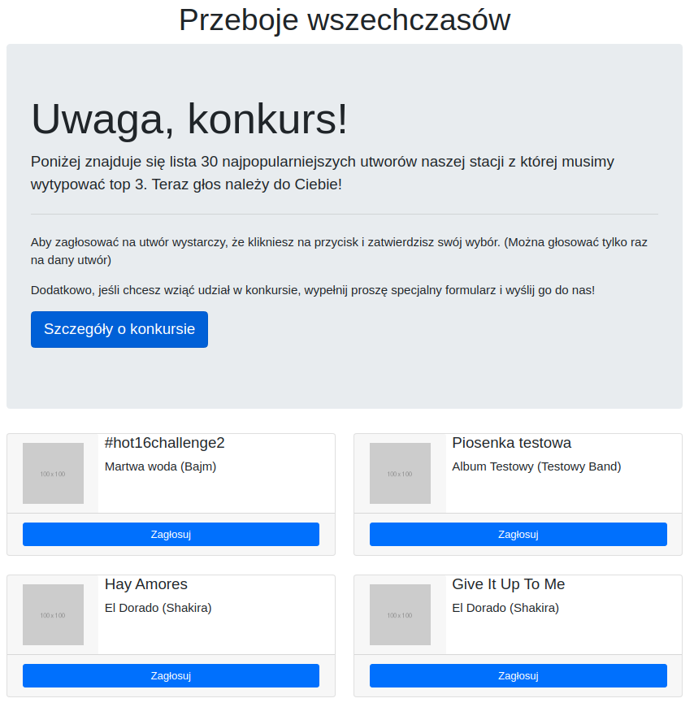
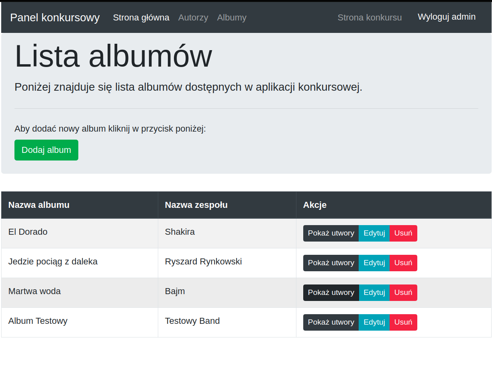

# Hits Contest
> Indicates the musical hit of all time by voting.

## Table of contents
* [General info](#general-info)
* [Screenshots](#screenshots)
* [Technologies](#technologies)
* [Features](#features)
* [Status](#status)

## General info
A project written in a group as a summary of the Advanced Django module of the Back-end developer course. The purpose of the application is to select a musical hit of all time by voting. The application has an administration panel that allows you to manage bands, albums and songs.

## Screenshots
#### Main page

#### Panel songs

## Technologies
* Python 3.6
* Django 3.0.7
* Bootstrap v4.5.0
* PostgreSQL
* django-crispy-forms 1.9.1
* psycopg2-binary 2.8.5

## Features

#### For everyone
* Voting for a selected piece of music.
* Voting and filling in the form to participate in the competition.

#### For the panel administrator
* Add, edit, delete teams, albums and songs.

#### Other
* Protection against multiple voting from the same address.
* The vote count is done by calling the command from the console.

## Status
Project is: _finished_

